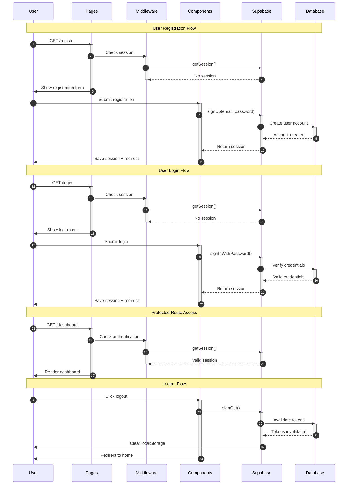

# Authentication Architecture Diagram - Secret Santa

This diagram shows the main authentication flows in the Secret Santa app using Astro 5 (SSR), React 19 and Supabase Auth.

<mermaid_diagram>

</mermaid_diagram>
